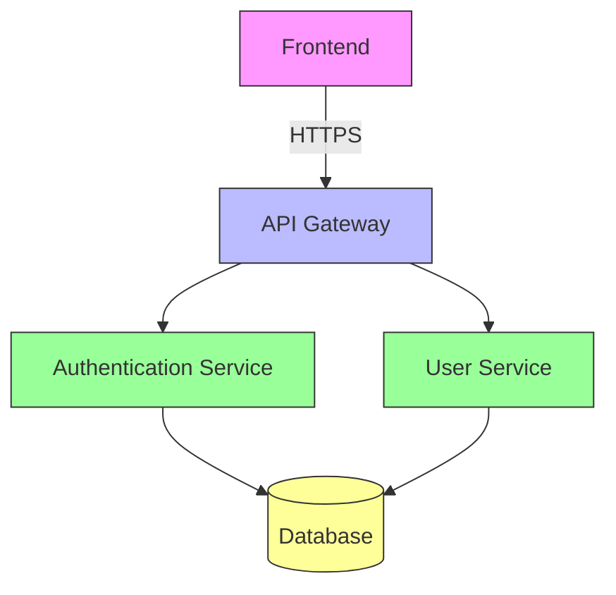

# System Architecture

## Overview
Cyclo Veda follows a modern, modular architecture with clear separation of concerns between the frontend and backend components.

## High-Level Architecture

## Backend Architecture

### Core Components

1. **API Layer**
   - FastAPI application
   - Request validation
   - Authentication/Authorization
   - Rate limiting (to be implemented)

2. **Services**
   - `AuthService`: Handles user authentication and JWT tokens
   - `UserService`: Manages user data and operations

3. **Data Layer**
   - SQLAlchemy ORM
   - Database migrations with Alembic
   - Connection pooling

4. **Models**
   - Pydantic models for request/response validation
   - SQLAlchemy models for database operations

## Frontend Architecture

### Core Components

1. **State Management**
   - React Context API for global state
   - Custom hooks for data fetching and state management

2. **Routing**
   - React Router for client-side routing
   - Protected and public routes
   - Lazy loading for code splitting

3. **UI Components**
   - Reusable UI components
   - Styled with CSS modules
   - Responsive design

## Data Flow

### Authentication Flow
1. User submits login form
2. Frontend sends credentials to `/api/auth/login`
3. Backend validates credentials and returns JWT
4. Frontend stores token and uses it for subsequent requests
5. Token is included in `Authorization` header for protected routes

### API Request Flow
1. Request is received by FastAPI
2. Authentication middleware validates JWT
3. Request is routed to appropriate endpoint
4. Service layer processes the request
5. Response is formatted and returned

## Security Considerations

### Authentication
- JWT with HS256
- Token expiration
- Secure token storage
- CSRF protection (to be implemented)

### Data Protection
- Input validation
- Output encoding
- SQL injection prevention (handled by SQLAlchemy)
- XSS protection (React's built-in protection)

## Scalability

### Horizontal Scaling
- Stateless authentication allows for easy scaling
- Database connection pooling
- Caching layer (to be implemented)

### Performance
- Asynchronous request handling
- Database query optimization
- Frontend code splitting

## Monitoring and Logging
(To be implemented)
- Structured logging
- Error tracking
- Performance monitoring
- Health checks

## Future Considerations
1. **Microservices**
   - Split into separate services as needed
   - API Gateway for routing

2. **Event-Driven Architecture**
   - Message queue for async processing
   - Event sourcing for critical operations

3. **Caching Layer**
   - Redis for session storage
   - Response caching for frequently accessed data

## Dependencies

### Backend
- FastAPI
- SQLAlchemy
- Pydantic
- Python-jose (JWT)
- Bcrypt (password hashing)
- Uvicorn (ASGI server)

### Frontend
- React
- TypeScript
- React Router
- Axios (HTTP client)
- React Query (to be implemented)

## Deployment Architecture

### Development
- Local development with hot-reload
- SQLite database

### Production
- Containerized with Docker
- PostgreSQL database
- Nginx as reverse proxy
- Let's Encrypt for SSL
- CI/CD pipeline (to be implemented)
